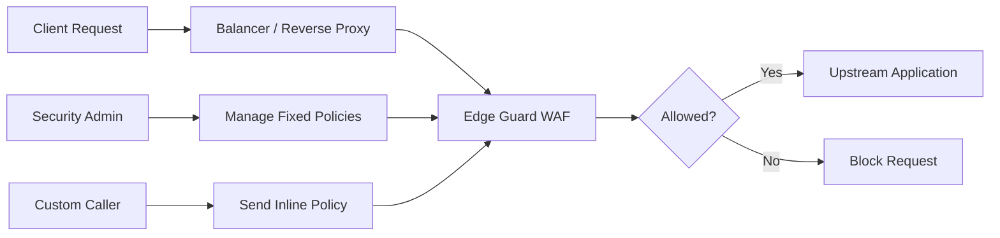
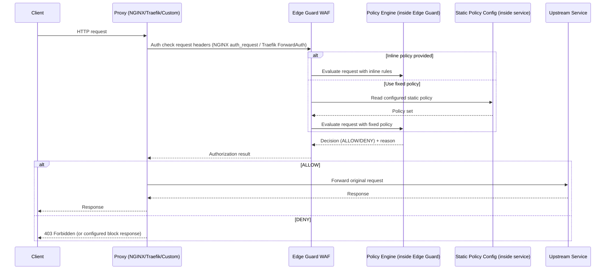
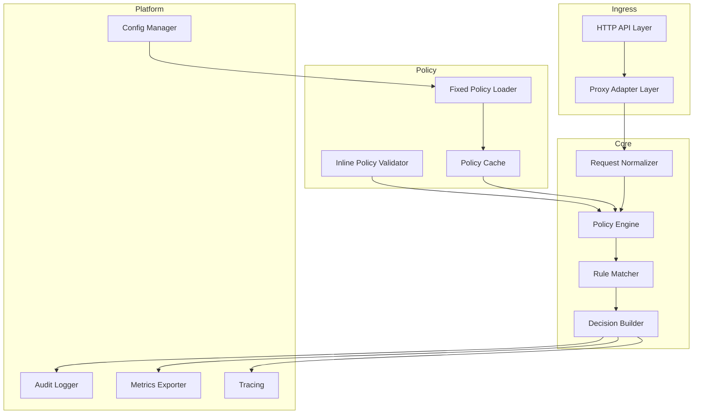

# Edge Guard WAF Microservice (Rust)

Edge Guard is a Web Application Firewall (WAF) microservice written in Rust.  
It receives authorization requests from reverse proxies and balancers (such as NGINX, Traefik, or custom clients), evaluates the request against security policies, and returns a simple decision:

- `ALLOW`
- `DENY`

In v1, the service supports both:

- fixed server-side security policies configured directly in the service
- per-request policy payloads for dynamic enforcement

## Core Capabilities

- Proxy-friendly authorization endpoint for external auth flows
- Deterministic policy evaluation with rule priorities
- Default fixed policy sets loaded from service configuration at startup
- Optional request-scoped policy override provided by trusted callers
- Geo-aware decisions using MaxMind GeoIP lookups (country, continent, EU)
- Structured decision responses with reason codes and rule matches
- Observability via metrics, logs, and audit events

## High-Level API Contract

Authorization checks are **header-only** in v1. Edge Guard does not read a request body for auth decisions; it evaluates forwarded headers sent by NGINX `auth_request` or Traefik `ForwardAuth`.

### Authorization Request (proxy headers)

Edge Guard receives an HTTP request from the proxy with forwarded headers only (no request body required).

Common incoming headers:

- `x-forwarded-method`: original HTTP method (for example `GET`, `POST`)
- `x-forwarded-uri`: original URI + query string
- `x-forwarded-host`: target host
- `x-forwarded-proto`: original protocol (`http` or `https`)
- `x-forwarded-for`: client IP chain
- `user-agent`: original user agent when forwarded by the proxy

Optional policy override headers (trusted callers only):

- `x-eg-policy-mode`: `fixed` or `inline`
- `x-eg-fixed-policy-id`: select a configured fixed policy by ID (optional, only for `fixed` mode)
- `x-eg-inline-token`: shared secret required for `inline` mode
- `x-eg-inline-policy-b64`: base64url(no-padding) encoded inline policy JSON

If `x-eg-fixed-policy-id` is omitted, Edge Guard uses `active_policy_id`. If an unknown fixed policy ID is sent, Edge Guard returns `400`.

Geo rules use the first IP in `x-forwarded-for` for country/continent/EU matching.

### Authorization Response (proxy-friendly)

Edge Guard returns a simple allow/deny response for the proxy:

- `2xx` -> allow request
- `403` -> deny request

Optional response headers:

- `x-eg-decision`: `ALLOW` or `DENY`
- `x-eg-reason`: matched rule or decision reason
- `x-eg-policy-id`: policy identifier used during evaluation
- `x-eg-trace-id`: correlation trace id
- `x-eg-geo-country`: resolved country ISO code or `unknown`
- `x-eg-geo-continent`: resolved continent code or `unknown`
- `x-eg-geo-eu`: `true`, `false`, or `unknown`

## Use Case Diagram



## Sequence Diagram



## Subsystem Diagram



## Policy Model

- **Fixed policies (v1)**: static rule sets configured in the Edge Guard service and applied by default to all traffic.
- **Inline policies**: optional rules provided in trusted request metadata; validated before evaluation.
- **Geo actions**: rules can match by country ISO code, continent code, or EU membership.
- **Evaluation order**: normalize request -> apply pre-filters -> run matchers -> produce decision -> emit audit event.
- **Conflict handling**: explicit priority and fail-safe defaults (`DENY` on invalid policy or evaluation failure).
- **Future direction**: external policy sources (for example remote control-plane or policy registry) are planned for later versions.

### Geo Rule Types

- `country_in`: match when client country ISO (for example `DE`, `US`) is in `values`
- `continent_in`: match when client continent code (for example `EU`, `NA`) is in `values`
- `is_in_european_union`: match when EU membership boolean equals `value`

For `is_in_european_union`, if GeoIP data is unavailable, Edge Guard treats it as non-EU (`false`) for safer deny-by-default behavior.

## Rust Implementation Direction

- Web stack: `axum` or `actix-web`
- Serialization: `serde`, `serde_json`
- Async runtime: `tokio`
- Policy parsing/validation: custom crate modules with strongly typed rule schemas
- Observability: `tracing`, `metrics`, OpenTelemetry exporters
- Performance targets: low-latency checks, memory-safe concurrency, predictable throughput

## Example Integration Notes

- **NGINX**: use `auth_request` and map WAF decision/status to upstream routing.
- **Traefik**: use `ForwardAuth` middleware to call Edge Guard before forwarding traffic.
- **Custom callers**: POST to authorization endpoint and enforce result in gateway logic.

## Future Enhancements

- Rule marketplace and managed policy bundles
- Adaptive rate-limiting signals
- Attack signature auto-updates
- Admin API and policy lifecycle workflows
- Replay/testing mode for safe policy rollout

## Endpoints

- `GET /healthz`: liveness check
- `GET /authorize`: proxy auth endpoint
- `POST /authorize`: optional compatibility endpoint (header-only contract still applies)

## Run Locally With Docker

```bash
export GEOLITE2_COUNTRY_MMDB_URL="https://example.internal/GeoLite2-Country.mmdb"
docker compose up --build
```

or, using direct MaxMind credentials:

```bash
export MAXMIND_ACCOUNT_ID="your_maxmind_account_id"
export MAXMIND_LICENSE_KEY="your_maxmind_license_key"
docker compose up --build
```

Service listens on `http://localhost:8080`.

Geo DB source precedence during image build:

1. If `GEOLITE2_COUNTRY_MMDB_URL` is set, Edge Guard downloads `GeoLite2-Country.mmdb` from that static URL.
2. Otherwise, it downloads from MaxMind using `MAXMIND_ACCOUNT_ID` + `MAXMIND_LICENSE_KEY`.

The downloaded DB is embedded in image layers at `/app/data/GeoLite2-Country.mmdb`. On startup, Edge Guard loads this DB into memory to avoid runtime disk latency.

If build fails with `401`, verify your MaxMind account is enabled for GeoLite downloads and that both credentials are correct.

## Test With Docker (no local cargo required)

```bash
docker run --rm -v "$PWD":/app -w /app rust:1.87-bookworm bash -lc "cargo test"
```

## Example Auth Check

```bash
curl -i http://localhost:8080/authorize \
  -H "x-forwarded-method: GET" \
  -H "x-forwarded-uri: /admin/dashboard" \
  -H "x-forwarded-host: example.local" \
  -H "x-forwarded-proto: https" \
  -H "x-forwarded-for: 203.0.113.10" \
  -H "user-agent: curl/8.0"
```

Expected result: `403` with `x-eg-decision: DENY` due to baseline `/admin` deny rule.

## Example Inline Check With Specific Policy ID

The example below sends an inline policy with `policy_id: partner-a-v1`.

```bash
INLINE_POLICY_B64=$(printf '%s' '{"policy_id":"partner-a-v1","rules":[{"id":"deny-secret-path","priority":300,"action":"deny","type":"path_contains","value":"/secret"}]}' | base64 -w0 | tr '+/' '-_' | tr -d '=')

curl -i http://localhost:8080/authorize \
  -H "x-forwarded-method: GET" \
  -H "x-forwarded-uri: /secret/data" \
  -H "x-forwarded-host: example.local" \
  -H "x-eg-policy-mode: inline" \
  -H "x-eg-inline-token: change-me-inline-token" \
  -H "x-eg-inline-policy-b64: ${INLINE_POLICY_B64}"
```

Expected result: `403` with `x-eg-policy-id: partner-a-v1` and `x-eg-decision: DENY`.

## Example Fixed Check With Non-Active Policy ID

Use fixed mode and select a configured policy ID that is not the active default (`baseline-v1`), for example `strict-v2`.

```bash
curl -i http://localhost:8080/authorize \
  -H "x-forwarded-method: GET" \
  -H "x-forwarded-uri: /private/report" \
  -H "x-forwarded-host: example.local" \
  -H "x-forwarded-for: 203.0.113.10" \
  -H "x-eg-policy-mode: fixed" \
  -H "x-eg-fixed-policy-id: strict-v2"
```

Expected result: `403` with `x-eg-policy-id: strict-v2` because `strict-v2` contains a deny rule for `/private`.

## Example Geo Policy Rule

`strict-v2` can include geo-based deny actions:

```yaml
- id: deny-non-eu
  priority: 380
  action: deny
  type: is_in_european_union
  value: false
```

With that rule enabled, requests from non-EU client IPs are denied (based on MaxMind lookup of `x-forwarded-for`).

## License

This project is licensed under the GNU Affero General Public License v3.0 (`AGPL-3.0`).
See `LICENSE` for details.
